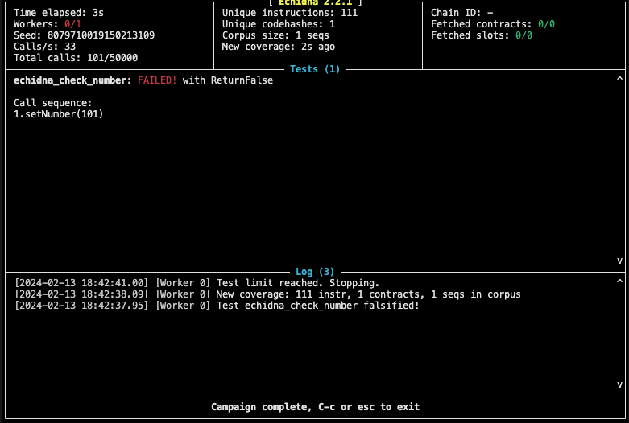

# Echdnia Test

## Installtion with docker 

Run the command below
```bash
docker run -it -v "$PWD":/share trailofbits/eth-security-toolbox
```
Go to the repertory /share/
```bash
ethsec@579fe7a15cb0:/share$ 
```

## Test Echidna with property mode

We will test Counter.sol Contract
```javascript
// SPDX-License-Identifier: UNLICENSED
pragma solidity ^0.8.13;

contract Counter {
    uint256 public number;

    function setNumber(uint256 newNumber) public {
        number = newNumber;
    }

    function increment() public {
        number++;
    }
}
```

Create the Echidna test file
```javascript
// SPDX-License-Identifier: UNLICENSED
pragma solidity ^0.8.13;

import {Counter} from "../src/Counter.sol";

contract TestCounter is Counter {

    function echidna_check_number() public view returns(bool) {
        return (number >= 0 && number <= 100);
    }
}
```

To run Echidna property test , run the command below
```bash
 echidna ./test/TestCounter.sol --contract TestCounter
 ```

You should the result below, that show that the est fail , and the call that make it fail 




## Test with Assertion mode

We will tes echdna with assertion mode
```javascript
contract Incrementor {
    event AssertionFailed(uint256);

    uint256 private counter = 2 ** 200;

    function inc(uint256 val) public returns (uint256) {
        uint256 tmp = counter;
        unchecked {
            counter += val;
        }
        if (tmp > counter) {
            emit AssertionFailed(counter);
        }
        return (counter - tmp);
    }
}
```

 run the command 
 ```bash
 echidna ./test/Incrementor.sol --test-mode assertion
 ```

## Testing Approaches

### Internal testing

properties are defined within the contract to test, giving complete access to the internal state of the system.

```javascript
contract InternalTest is System {
    function echidna_state_greater_than_X() public returns (bool) {
        return stateVar > X;
    }
}
```

### External Testing
properties are tested using external calls from a different contract. Properties are only allowed to access external/public variables or functions.

```javascript
contract ExternalTest {
    constructor() public {
        addr = address(0x1234);
    }

    function echidna_state_greater_than_X() public returns (bool) {
        return System(addr).stateVar() > X;
    }
}
```

## Add filter to Echidna 

We will use the code below : Multi.sol  and add blacklist.yaml

- Multi.sol
```javascript
// SPDX-License-Identifier: UNLICENSED
pragma solidity ^0.8.13;

contract Multi {
    bool state1 = false;
    bool state2 = false;
    bool state3 = false;
    bool state4 = false;

    function f(uint256 x) public {
        require(x == 12);
        state1 = true;
    }

    function g(uint256 x) public {
        require(state1);
        require(x == 8);
        state2 = true;
    }

    function h(uint256 x) public {
        require(state2);
        require(x == 42);
        state3 = true;
    }

    function i() public {
        require(state3);
        state4 = true;
    }

    function reset1() public {
        state1 = false;
        state2 = false;
        state3 = false;
        return;
    }

    function reset2() public {
        state1 = false;
        state2 = false;
        state3 = false;
        return;
    }

    function echidna_state4() public returns (bool) {
        return (!state4);
    }
}
````
- ./config/blacklist.yaml
```yaml
filterBlacklist: false
filterFunctions: ["C.f(uint256)", "C.g(uint256)", "C.h(uint256)", "C.i()"]
```

Run the command below to lauch the test
```bash
echidna ./test/Multi.sol --contract Multi --config ./config/config.yaml
```

## Collecting, Visualizing, and Modifying an Echidna Corpus

we create the ollowing smart contract.
```javascript
// SPDX-License-Identifier: UNLICENSED
pragma solidity ^0.8.13;

contract Magic {
    bool value_found = false;

    function magic(uint256 magic_1, uint256 magic_2, uint256 magic_3, uint256 magic_4) public {
        require(magic_1 == 42);
        require(magic_2 == 129);
        require(magic_3 == magic_4 + 333);
        value_found = true;
        return;
    }

    function echidna_magic_values() public view returns (bool) {
        return !value_found;
    }
}
```

-create a corpus directory:
```bash
mkdir corpus-magic
```
create an Echidna configuration file called config.yaml:
```yaml
corpusDir: "corpus-magic"
```

- review the corpus-magic/covered.*.txt


## Optimizing with Echidna
This small example directs Echidna to maximize a specific price difference given certain preconditions. If the preconditions are not met, the function will revert without changing the actual value.

arget is the following smart contract TestDutchAuctionOptimization.sol
```javascript
contract TestDutchAuctionOptimization {
    int256 maxPriceDifference;

    function setMaxPriceDifference(uint256 startPrice, uint256 endPrice, uint256 startTime, uint256 endTime) public {
        if (endTime < (startTime + 900)) revert();
        if (startPrice <= endPrice) revert();

        uint256 numerator = (startPrice - endPrice) * (block.timestamp - startTime);
        uint256 denominator = endTime - startTime;
        uint256 stepDecrease = numerator / denominator;
        uint256 currentAuctionPrice = startPrice - stepDecrease;

        if (currentAuctionPrice < endPrice) {
            maxPriceDifference = int256(endPrice - currentAuctionPrice);
        }
        if (currentAuctionPrice > startPrice) {
            maxPriceDifference = int256(currentAuctionPrice - startPrice);
        }
    }

    function echidna_opt_price_difference() public view returns (int256) {
        return maxPriceDifference;
    }
}
```

- Run the command
```bash 
echidna opt.sol --test-mode optimization --test-limit 100000 --seq-len 1 --corpus-dir corpus --shrink-limit 50000
```


## allContracts in Echidna

allContracts testing is useful: It allows Echidna to call functions from other contracts (not just from the contract under test), sending the transactions from the same accounts that will interact with the target contract.

we have 2 contracts

```javascript
// SPDX-License-Identifier: UNLICENSED
pragma solidity ^0.8.13;

contract Flag {
    bool flag = false;

    function flip() public {
        flag = !flag;
    }

    function get() public returns (bool) {
        return flag;
    }

    function test_fail() public {
        assert(false);
    }
}
```

```javascript
// SPDX-License-Identifier: UNLICENSED
pragma solidity ^0.8.13;

import {Flag} from "./Flag.sol";

contract EchidnaTest {
    Flag f;

    constructor() {
        f = new Flag();
    }

    function test_flag_is_false() public {
        assert(f.get() == false);
    }
}
````

We can run the command
```bash
echidna ./test/Flag.sol --contract EchidnaTest --config allContracts.yaml
```


## fuzzing with state forking


```javascript
// SPDX-License-Identifier: UNLICENSED
pragma solidity ^0.8.13;

interface IHevm {
    function warp(uint256 newTimestamp) external;

    function roll(uint256 newNumber) external;
}

interface Compound {
    function mint() external payable;

    function balanceOf(address) external view returns (uint256);
}

contract CompoundTest {
    address constant HEVM_ADDRESS = 0x7109709ECfa91a80626fF3989D68f67F5b1DD12D;
    IHevm hevm = IHevm(HEVM_ADDRESS);
    Compound comp = Compound(0x4Ddc2D193948926D02f9B1fE9e1daa0718270ED5);

    constructor() {
        hevm.roll(16771449); // sets the correct block number
        hevm.warp(1678131671); // sets the expected timestamp for the block number
    }

    function assertNoBalance() public payable {
        require(comp.balanceOf(address(this)) == 0);
        comp.mint{ value: msg.value }();
        assert(comp.balanceOf(address(this)) == 0);
    }
}
```

Run the command
ECHIDNA_RPC_URL=https://mainnet.infura.io/v3/fde8985d55cc4e718bcb40718e01b2e2 ECHIDNA_RPC_BLOCK=16771449 echidna ./test/CompoundTest.sol --test-mode assertion
